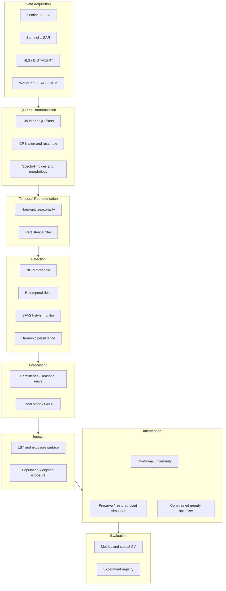

# CANOPY System Architecture

## Module map

| Layer | Package | Entry points |
|---|---|---|
| Config | `canopy.config` | YAML load/merge |
| Indices | `canopy.features.indices` | NDVI, EVI, NDWI, NDBI, SAVI |
| Temporal | `canopy.temporal.*` | Harmonic fit, persistence |
| Detection | `canopy.detection.baselines` | All detector methods |
| Forecasting | `canopy.forecasting.baselines` | Horizon forecasts |
| Heat | `canopy.heat.exposure` | Exposure surfaces |
| Optimization | `canopy.optimization.engine` | Optimizer + baselines |
| Uncertainty | `canopy.uncertainty.conformal` | Intervals, ranking stability |
| Evaluation | `canopy.evaluation.*` | Metrics, splits, registry |
| Experiments | `canopy.experiments.mvre` | MVRE runner |

## Runnable scripts

| Script | Purpose |
|---|---|
| `scripts/run_mvre.py` | Minimum viable detection experiment |
| `scripts/run_optimization_eval.py` | Optimization baseline comparison |
| `scripts/gee_export_sentinel2.py` | GEE export template |
| `app/research_interface.py` | Cell-level trajectory inspector |
